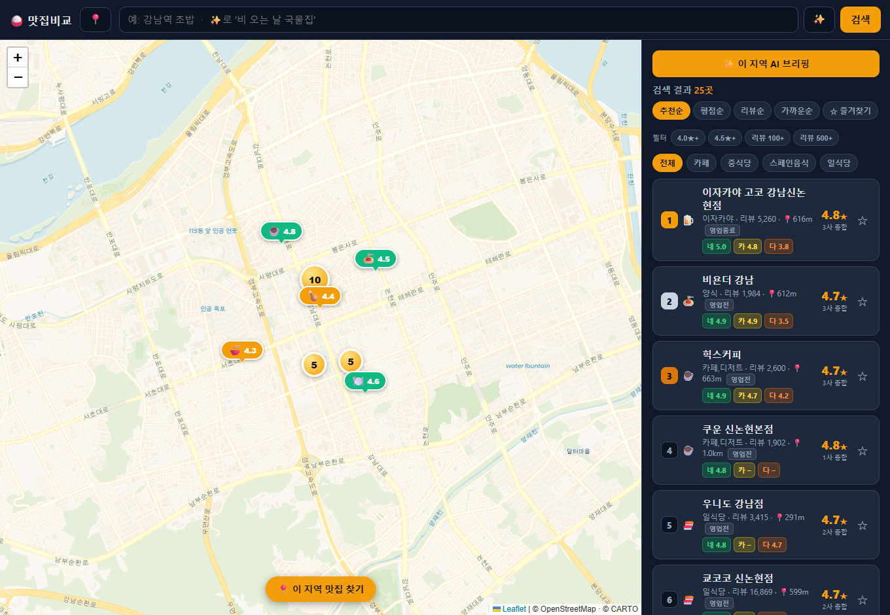
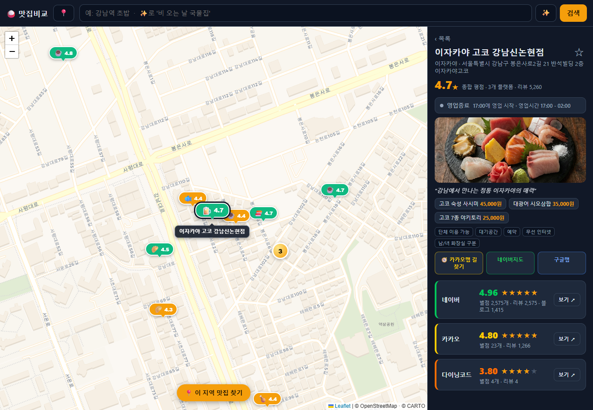
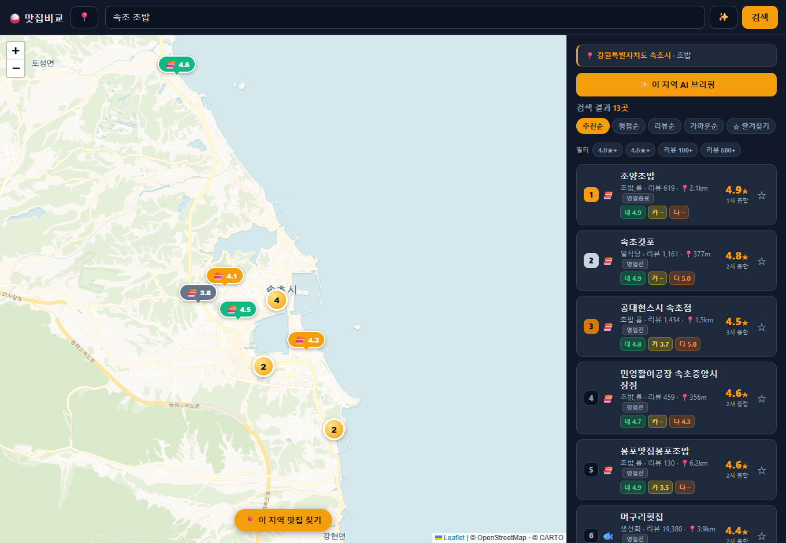

<div align="center">

# 🍚 맛집비교 지도

**네이버 · 카카오 · 다이닝코드 별점을 한 지도에서 비교하는 맛집 탐색 앱**

호텔 최저가 비교처럼, 여러 지도앱에 흩어진 맛집 별점·리뷰수를 한 화면에 모아
**베이지안 종합 점수**로 진짜 맛집을 찾아줍니다.



</div>

## ✨ 주요 기능

- **3사 별점 비교** — 네이버·카카오·다이닝코드의 별점/리뷰수를 한 카드에 나란히 (구글은 API 키를 넣으면 자동 추가)
- **종합 점수** — 단순 평균의 함정을 피하는 **베이지안 평균**(리뷰가 적은 고득점은 신뢰도를 낮춤)에 리뷰 볼륨·교차검증 보너스를 더해 추천 점수 산출
- **지역명 검색** — `속초`, `속초 초밥`, `홍대`처럼 입력하면 그 지역으로 지도를 옮겨 로컬 맛집을 검색 (지오코딩)
- **자연어 검색 ✨** — "비 오는 날 국물집" 같은 문장을 검색 키워드로 변환 (Claude API, 키 없으면 규칙 기반 폴백)
- **영업중 여부 · 영업시간** — 지금 영업 중인지 배지로 표시하고 영업시간 안내
- **길찾기** — 카카오맵 · 네이버지도 · 구글맵 원터치 길찾기 (모바일은 앱으로)
- **거리 · 가까운순 정렬**, **별점·리뷰 필터**, **마커 클러스터링**, **즐겨찾기**
- **PWA** — 모바일 홈 화면 추가 / 데스크톱 설치 지원 (코드 한 벌로 모바일·데스크톱)

## 🖼️ 스크린샷

| 플랫폼별 상세 비교 | 지역명 검색 (`속초 초밥`) |
| :--: | :--: |
|  |  |

## 🚀 실행

```bash
npm install
npm start
# → http://localhost:5178
```

(선택) 구글 별점과 AI 브리핑을 켜려면 `.env`를 만들어 키를 넣으세요:

```bash
cp .env.example .env
# GOOGLE_MAPS_API_KEY : 구글 별점/리뷰수 (없으면 네이버·카카오·다이닝코드만)
# ANTHROPIC_API_KEY   : 자연어 검색 · AI 지역 브리핑 (없으면 규칙 기반)
```

## 🧩 동작 원리

1. **후보 수집** — 네이버 지도 검색으로 위치·이름 후보를 빠르게 받아 **마커를 즉시** 띄운다
2. **별점 보강** — 각 후보에 카카오·다이닝코드를 이름+좌표로 매칭해 별점/리뷰수를 채운다 (2단계 로딩)
3. **같은 가게 매칭** — 상호 bigram 유사도 + Haversine 거리로 플랫폼 간 동일 가게를 판별한다
4. **종합 점수** — 베이지안 평균으로 3사 별점을 신뢰도 가중해 하나의 점수로 통합한다

## 🛠️ 기술 스택

- **백엔드** — Node.js + Express (ESM, 빌드 단계 없음) · TTL 메모리 캐시
- **프런트엔드** — Vanilla JS + Leaflet + Leaflet.markercluster · CARTO Voyager 타일
- **AI** — Anthropic Claude API (자연어 검색 · 지역 브리핑, 선택)

## ⚠️ 주의

개인용 · 학습용 **프로토타입**입니다. 네이버 · 카카오 · 다이닝코드의 **비공식 웹 응답**을 사용하므로
각 서비스의 약관에 저촉될 수 있으며, **상업적 사용이나 스토어 배포에는 적합하지 않습니다.**

---

<div align="center">
<sub>개인 학습 프로젝트 · Node.js + Leaflet</sub>
</div>
